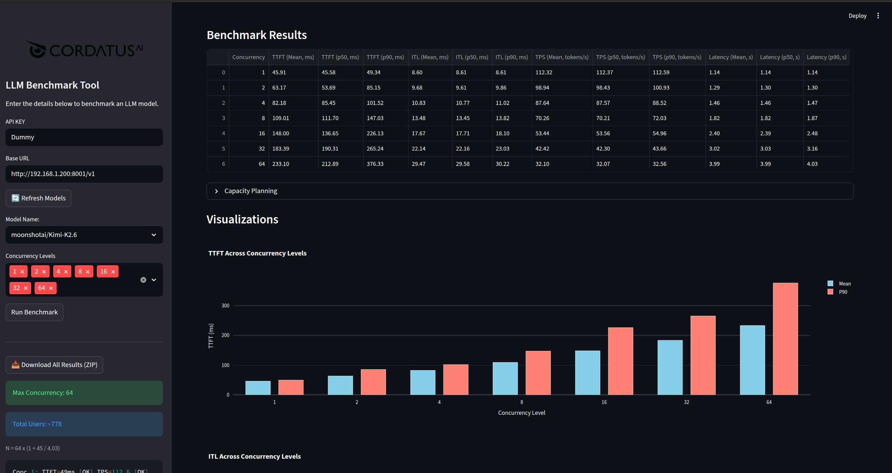

<div align="center">
  
</div>

# LLM Benchmark Tool

<div align="center">
  
</div>

An interactive Streamlit application for benchmarking LLM inference servers with OpenAI-compatible APIs. Measure performance across multiple concurrency levels, visualize results, and plan capacity using SLO-driven analysis with Little's Law.

## Features

- **OpenAI-Compatible API Support** — Works with any server exposing the `/v1/chat/completions` endpoint (vLLM, SGLang, TensorRT-LLM, Ollama, etc.)
- **Multi-Concurrency Testing** — Benchmark at concurrency levels 1 through 64 simultaneously
- **Comprehensive Metrics** — TTFT, ITL, TPS, Latency, and Throughput with Mean/P50/P90 percentiles
- **SLO-Driven Capacity Planning** — Determine max concurrency and total users based on configurable TTFT/TPS thresholds using Little's Law
- **Interactive Visualizations** — Grouped bar charts (Mean vs P90) for all metrics via Plotly
- **One-Click Download** — Export all results as a ZIP archive containing CSV tables, PNG charts, and interactive HTML plots
- **Streaming API** — Uses streaming completions with `include_usage` for accurate token counting; supports `reasoning_content` from reasoning models
- **Warm-Up Mechanism** — Automatically sends a warm-up request before benchmarking to stabilize inference performance

## Quick Start

### Option 1: Local

```bash
pip install -r requirements.txt
streamlit run benchmark.py
```

### Option 2: Docker

```bash
docker build -t llm-benchmark .
docker run -p 8501:8501 --add-host=host.docker.internal:host-gateway llm-benchmark
```

> `--add-host=host.docker.internal:host-gateway` is needed if your LLM server runs on the host machine. If the server is reachable via a regular IP/hostname, you can omit this flag.

## Usage

1. Enter your **Base URL** (e.g., `http://192.168.1.100:8000/v1`) in the sidebar
2. Click **Refresh Models** to fetch available models from the server
3. Select a **Model** from the dropdown
4. Choose **Concurrency Levels** to test (e.g., 1, 2, 4, 8)
5. Click **Run Benchmark**
6. View results in the main area:
   - **Benchmark Results** table with all metrics
   - **Capacity Planning** (click to expand) with SLO pass/fail analysis
   - **Visualizations** with Mean vs P90 grouped bar charts
7. Adjust **TTFT SLO**, **TPS SLO**, **Percentile**, and **Think Time** in the sidebar to recalculate capacity planning in real time
8. Click **Download All Results (ZIP)** in the sidebar to export

## Metrics

| Metric | Unit | Description |
|--------|------|-------------|
| **TTFT** | ms | Time To First Token — delay from request to first generated token |
| **ITL** | ms | Inter-Token Latency — average time between consecutive tokens |
| **TPS** | tokens/s | Tokens Per Second — output generation speed |
| **Latency** | s | Total request latency from start to finish |
| **Throughput** | RPS | Requests Per Second — aggregate throughput at given concurrency |

Each metric is reported with **Mean**, **P50** (median), and **P90** (90th percentile) values.

## Test Parameters

| Parameter | Value | Description |
|----------|-------|-------------|
| Prompt count | 100 | Diverse prompts loaded from `prompts.txt` (auto-shuffled each run) |
| Prompt length | ~128 tokens | Each prompt explicitly requests at least 128 tokens |
| Max output tokens | 128 | Responses truncated after 128 tokens (`DEFAULT_MAX_TOKENS`) |
| Min rounds per concurrency | 10 | Each concurrency level runs at least 10 rounds (`MIN_ROUNDS`) |
| Total requests per level | 10 × concurrency | e.g., concurrency=8 → 80 requests, concurrency=16 → 160 |

Both input and output are approximately 128 tokens, creating a consistent and reproducible benchmark workload.

## Capacity Planning

Capacity planning determines the maximum concurrency level that satisfies both TTFT and TPS SLO thresholds, then estimates total users using Little's Law:

```
N = C_max × (1 + T_think / L_mean)
```

| Variable | Description |
|----------|-------------|
| `N` | Total number of concurrent users the system can support |
| `C_max` | Maximum concurrency where both TTFT ≤ SLO and TPS ≥ SLO |
| `T_think` | Average think time between user requests (seconds) |
| `L_mean` | Mean latency at `C_max` (seconds) |

### Default SLO Thresholds

| Parameter | Default | Adjustable |
|-----------|---------|------------|
| TTFT SLO | 1000 ms | Yes (sidebar) |
| TPS SLO | 15 tokens/s | Yes (sidebar) |
| Percentile | P90 | Yes (P90 or Mean) |
| Think Time | 45 s | Yes (1–600 s) |

### SLO Rationale

**TTFT SLO = 1000 ms (1 second)**

Based on Jakob Nielsen's "3 Response Time Limits" ([NNGroup](https://www.nngroup.com/articles/response-times-3-important-limits/), originally Miller 1968, Card 1991):

- **0.1 s** — user feels the system is reacting instantaneously
- **1.0 s** — user's flow of thought stays uninterrupted
- **10 s** — limit for keeping the user's attention

In LLM streaming scenarios, TTFT under 1 second ensures the user perceives the system as responsive and their thought flow is not broken while waiting for the first token to appear.

> Miller, R. B. (1968). "Response time in man-computer conversational transactions." *Proc. AFIPS Fall Joint Computer Conference*, Vol. 33, 267-277.

**TPS SLO = 15 tokens/s**

Based on human reading speed research ([Wikipedia: Speed reading](https://en.wikipedia.org/wiki/Speed_reading), Rayner et al. 2016):

- Normal reading (subvocalization): ~250 wpm ≈ 5 tok/s (1 word ≈ 1.3 tokens)
- Proficient reading: 280–350 wpm ≈ 6–7.5 tok/s
- **Visual reading**: ~700 wpm ≈ **15 tok/s** — the upper limit where the eye can comfortably track text without comprehension loss
- Speeds above 900 wpm are not feasible given the anatomy of the eye; comprehension declines sharply above 400–500 wpm

At 15 tok/s, the model outputs text at the visual reading threshold — fast enough that users can follow along in real time without waiting, yet within the bounds of what the human eye can comfortably process.

> Rayner, K., Schotter, E. R., Masson, M. E. J., Potter, M. C., & Treiman, R. (2016). "So Much to Read, So Little Time." *Psychological Science in the Public Interest*, 17(1), 4–34.

**Think Time = 45 seconds**

Based on capacity planning literature and typical chat interaction patterns:

- User reads the response (~8–20 s for 128 tokens at 15 tok/s + comprehension)
- User writes a new prompt (~15–25 s)
- Total interaction cycle: ~25–45 seconds
- Industry standards for web server capacity planning assume 30–60 s think time ([Little's Law](https://en.wikipedia.org/wiki/Little%27s_law))

> Menascé, D. A. (2004). "Performance by Design." *Prentice Hall*.

## Configuration

Constants can be modified at the top of `benchmark.py`:

| Constant | Default | Description |
|----------|---------|-------------|
| `DEFAULT_BASE_URL` | `http://127.0.1.1:8000/v1` | Default API endpoint |
| `DEFAULT_MAX_TOKENS` | 128 | Max tokens per completion |
| `DEFAULT_CONCURRENCY_LEVELS` | [1, 2, 4, 8] | Concurrency levels to test |
| `MIN_ROUNDS` | 10 | Minimum rounds per concurrency level |
| `DEFAULT_TTFT_SLO` | 1000 | TTFT threshold (ms) |
| `DEFAULT_TPS_SLO` | 15 | TPS threshold (tokens/s) |
| `DEFAULT_THINK_TIME` | 45 | Think time (seconds) |
| `REQUEST_TIMEOUT` | 50 | Request timeout (seconds) |

## Project Structure

```
llm_benchmark/
├── benchmark.py        # Main application (Streamlit UI + benchmark logic)
├── prompts.txt         # 100 diverse test prompts (auto-shuffled)
├── requirements.txt    # Python dependencies
├── images/
│   └── CORDATUS_LOGO.png
└── out/                # Output directory (gitignored)
```

## Requirements

- Python 3.10+
- httpx
- openai
- pandas
- plotly
- requests
- streamlit

## License

This project is licensed under the [GNU General Public License v3.0](LICENSE).
